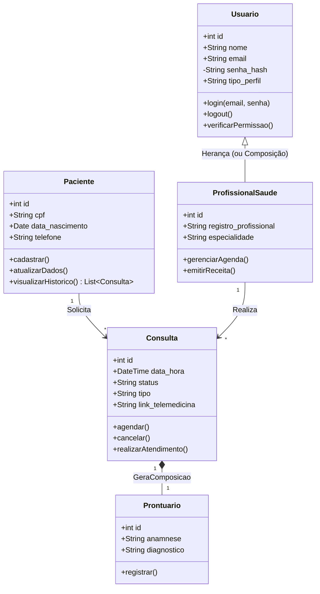

```mermaid

classDiagram
 
    %% Classes Base
    class Usuario {
        +int id
        +String nome
        +String email
        -String senha_hash
        +String tipo_perfil
        +login(email, senha)
        +logout()
        +verificarPermissao()
    }

    class Paciente {
        +int id
        +String cpf
        +Date data_nascimento
        +String telefone
        +cadastrar()
        +atualizarDados()
        +visualizarHistorico() List~Consulta~
    }

    class ProfissionalSaude {
        +int id
        +String registro_profissional
        +String especialidade
        +gerenciarAgenda()
        +emitirReceita()
    }

    class Consulta {
        +int id
        +DateTime data_hora
        +String status
        +String tipo
        +String link_telemedicina
        +agendar()
        +cancelar()
        +realizarAtendimento()
    }

    class Prontuario {
        +int id
        +String anamnese
        +String diagnostico
        +registrar()
    }


    %% Relacionamentos
    Usuario <|-- ProfissionalSaude : Herança (ou Composição)
    Paciente "1" --> "*" Consulta : Solicita
    ProfissionalSaude "1" --> "*" Consulta : Realiza
    Consulta "1" *-- "1" Prontuario : GeraComposicao
```

