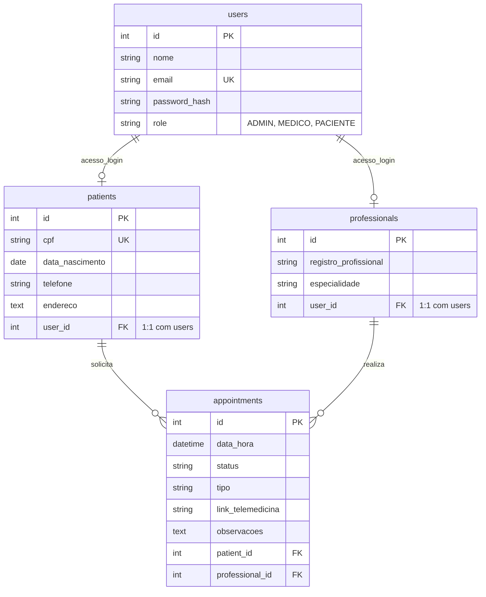

```mermaid

erDiagram
    users {
        int id PK
        string nome
        string email UK
        string password_hash
        string role "ADMIN, MEDICO, PACIENTE"
    }

    patients {
        int id PK
        string cpf UK
        date data_nascimento
        string telefone
        text endereco
        int user_id FK "1:1 com users"
    }

    professionals {
        int id PK
        string registro_profissional
        string especialidade
        int user_id FK "1:1 com users"
    }

    appointments {
        int id PK
        datetime data_hora
        string status
        string tipo
        string link_telemedicina
        text observacoes
        int patient_id FK
        int professional_id FK
    }

    users ||--o| patients : "acesso_login"
    users ||--o| professionals : "acesso_login"
    patients ||--o{ appointments : "solicita"
    professionals ||--o{ appointments : "realiza"

```