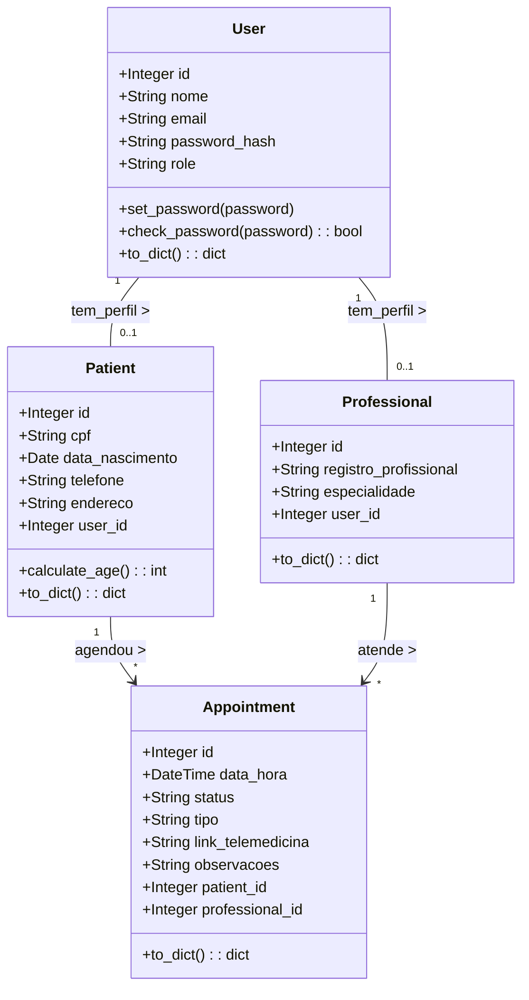

```mermaid
classDiagram
    %% Classe Base de Usuário (Autenticação)
    class User {
        +Integer id
        +String nome
        +String email
        +String password_hash
        +String role
        +set_password(password)
        +check_password(password) : bool
        +to_dict() : dict
    }

    %% Classe Paciente
    class Patient {
        +Integer id
        +String cpf
        +Date data_nascimento
        +String telefone
        +String endereco
        +Integer user_id
        +calculate_age() : int
        +to_dict() : dict
    }

    %% Classe Profissional
    class Professional {
        +Integer id
        +String registro_profissional
        +String especialidade
        +Integer user_id
        +to_dict() : dict
    }

    %% Classe Agendamento
    class Appointment {
        +Integer id
        +DateTime data_hora
        +String status
        +String tipo
        +String link_telemedicina
        +String observacoes
        +Integer patient_id
        +Integer professional_id
        +to_dict() : dict
    }

    %% Relacionamentos
    User "1" -- "0..1" Patient : tem_perfil >
    User "1" -- "0..1" Professional : tem_perfil >
    Patient "1" --> "*" Appointment : agendou >
    Professional "1" --> "*" Appointment : atende >
```