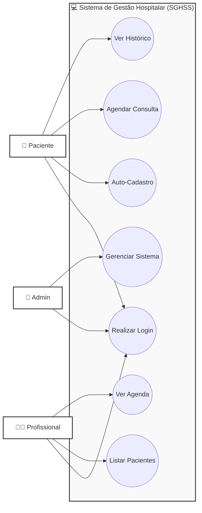

```mermaid
flowchart LR
    %% Atores (bolinhas ou bonecos simulados)
    P[👤 Paciente]
    M[👨‍⚕️ Profissional]
    A[👮 Admin]

    %% Sistema (Caixa Grande)
    subgraph SGHSS ["💻 Sistema de Gestão Hospitalar (SGHSS)"]
        direction TB
        UC1((Realizar Login))
        UC2((Auto-Cadastro))
        UC3((Agendar Consulta))
        UC4((Ver Histórico))
        UC5((Listar Pacientes))
        UC6((Ver Agenda))
        UC7((Gerenciar Sistema))
    end

    %% Relacionamentos
    P --> UC1
    P --> UC2
    P --> UC3
    P --> UC4

    M --> UC1
    M --> UC5
    M --> UC6

    A --> UC1
    A --> UC7

    %% Estilização (Opcional, para ficar bonito)
    style P fill:#fff,stroke:#333,stroke-width:2px
    style M fill:#fff,stroke:#333,stroke-width:2px
    style A fill:#fff,stroke:#333,stroke-width:2px
    style SGHSS fill:#f9f9f9,stroke:#333,stroke-width:2px
```
    